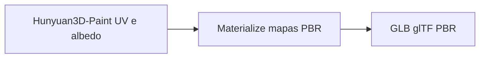

# PBR completo no GLB — Hunyuan3D-Paint + Materialize

Pipeline Paint3D: **Hunyuan3D-Paint** (albedo + UV) → **Materialize CLI** (normal, oclusão, metallic-roughness) → ficheiro **glTF 2.0 / GLB** com material PBR embutido.

Para setup do rasterizador, ver [PAINT_SETUP.md](PAINT_SETUP.md).

---

## O problema que isto resolve

- O **Hunyuan3D-Paint** produz uma mesh com **uma textura base (albedo)** adequada ao jogo/engine.
- Muitos motores beneficiam de **normal map**, **occlusion** e **metallic/roughness** para iluminação física.
- O **Materialize** (monorepo `GameDev/Materialize`) gera esses mapas a partir do **mesmo albedo** que já está na mesh, sem modelo de IA extra — só shaders na GPU (wgpu).

O Paint3D **extrai o albedo da mesh já pintada**, corre o binário `materialize`, **empacota** metallic + roughness no formato glTF (canal **G** = roughness, **B** = metallic), e volta a exportar o GLB com `PBRMaterial` (trimesh).

---

## Fluxo (visão geral)



| Etapa | Entrada | Saída |
|--------|---------|--------|
| Paint | Malha + imagem de referência | Malha + UV + textura albedo |
| Materialize | PNG do albedo (extraído da mesh) | Normal, metallic, smoothness, AO, etc. |
| Empacotamento Paint3D | Mapas + UV preservados | GLB com `baseColor`, `normal`, `occlusion`, `metallicRoughness` |

---

## Uso na CLI

### Pintar + PBR num único comando

```bash
paint3d texture mesh.glb -i ref.png -o mesh_pbr.glb --materialize
```

### Guardar PNGs no disco

```bash
paint3d texture mesh.glb -i ref.png -o mesh_pbr.glb \
  --materialize --materialize-output-dir ./maps
```

### Só PBR (mesh já pintada)

```bash
paint3d materialize-pbr mesh_textured.glb -o mesh_pbr.glb
```

### Flags úteis

| Flag | Efeito |
|------|--------|
| `--materialize-output-dir DIR` | Escreve mapas auxiliares em `DIR`. |
| `--materialize-bin CAMINHO` | Binário explícito (se não usares PATH). |
| `--materialize-no-invert` | **Roughness = smoothness** direto (sem `1 − smoothness`). |
| `--materialize-preset PRESET` | Ajusta parâmetros PBR: default, skin, floor, metal, fabric, wood, stone. |

---

## Uso em Python

```python
from paint3d import apply_hunyuan_paint, apply_materialize_pbr, load_mesh_trimesh, save_glb

mesh = load_mesh_trimesh("mesh.glb")
mesh_tex = apply_hunyuan_paint(mesh, "ref.png")
mesh_pbr = apply_materialize_pbr(mesh_tex, save_sidecar_maps_dir="./maps")
save_glb(mesh_pbr, "out_pbr.glb")
```

---

## O que fica dentro do GLB

Material glTF **metallic-roughness** com texturas:

- **Base color** — albedo do Paint
- **Normal** — do Materialize
- **Occlusion** — AO do Materialize
- **Metallic-roughness** — um único PNG: **G** = roughness, **B** = metallic

---

## Referências no repositório

| Ficheiro | Conteúdo |
|----------|----------|
| [`src/paint3d/materialize_pbr.py`](../src/paint3d/materialize_pbr.py) | Extração de albedo, subprocess Materialize, packing glTF, `PBRMaterial` |
| [`src/paint3d/painter.py`](../src/paint3d/painter.py) | Paint; `paint_file_to_file` com opções `materialize_*` |
| [`src/paint3d/cli.py`](../src/paint3d/cli.py) | Flags `--materialize*` em `texture` e `materialize-pbr` |
| [`Materialize/README.md`](../../Materialize/README.md) | Build e uso do CLI Materialize |
