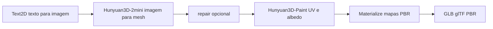

# PBR completo no GLB — Hunyuan3D-Paint + Materialize

Este documento junta **o que fazemos**, **o que validámos na prática** e **como usar** o encadeamento Text3D → **Hunyuan3D-Paint** (albedo + UV) → **Materialize CLI** (normal, oclusão, metallic-roughness) → ficheiro **glTF 2.0 / GLB** com material PBR embutido.

Para API Python detalhada, ver também [API.md](API.md). Para compilar o rasterizador do Paint, [PAINT_SETUP.md](PAINT_SETUP.md).

---

## O problema que isto resolve

- O **Hunyuan3D-Paint** produz uma mesh com **uma textura base (albedo)** adequada ao jogo/engine.
- Muitos motores beneficiam de **normal map**, **occlusion** e **metallic/roughness** para iluminação física.
- O **Materialize** (monorepo `GameDev/Materialize`) gera esses mapas a partir do **mesmo albedo** que já está na mesh, sem modelo de IA extra — só shaders na GPU (wgpu).

O Text3D **extrai o albedo da mesh já pintada**, corre o binário `materialize`, **empacota** metallic + roughness no formato glTF (canal **G** = roughness, **B** = metallic), e volta a exportar o GLB com `PBRMaterial` (trimesh).

---

## Fluxo (visão geral)



| Etapa | Entrada | Saída |
|--------|---------|--------|
| Text2D | Prompt | Imagem de referência |
| Hunyuan shape | Imagem | Malha sem material de jogo |
| Paint | Malha + mesma ref (semântica) | Malha + UV + textura albedo |
| Materialize | PNG do albedo (extraído da mesh) | Normal, metallic, smoothness, AO, etc. |
| Empacotamento Text3D | Mapas + UV preservados | GLB com `baseColor`, `normal`, `occlusion`, `metallicRoughness` |

**Mapas do Materialize que vão para o GLB:** normal, AO (oclusão), textura metallic-roughness combinada.

**Mapas não embutidos no material glTF core:** height, edge (continuam disponíveis como ficheiros se usares `--materialize-output-dir`; úteis para DCC ou pipelines custom).

---

## Achados na nossa configuração (validado)

Estes pontos foram **testados na prática** num portátil com **NVIDIA GeForce RTX 4050 Laptop (~5,6 GB VRAM total)** e PyTorch CUDA:

| Aspeto | Conclusão |
|--------|-----------|
| Perfil de memória | Os **defeitos** em `defaults.py` (~6 GB) são coerentes com máquinas modestas; Text2D em **CPU offload** evita OOM no FLUX. |
| `--preset fast` | Reduz passos Hunyuan + octree + chunks; **adequado** para iteração rápida e hardware limitado, com resultado visual ainda muito utilizável para objetos (ex.: caixote). |
| Pipeline completo | **Text2D → Hunyuan → Paint → Materialize** num único comando é **viável** no mesmo GPU; primeira execução puxa muitos GB do Hugging Face (tempo dominado por rede/cache). |
| Paint | Requer **`custom_rasterizer`** (CUDA); `text3d doctor` deve mostrar o rasterizador importável. |
| Materialize | Binário **`materialize`** no `PATH` (ou `MATERIALIZE_BIN`); projeto em [`Materialize/README.md`](../../Materialize/README.md) no monorepo. |

Tempos de ordem de grandeza (máquina já com modelos em cache, ordem aproximada): dezenas de segundos a poucos minutos para um fluxo completo, conforme preset e primeira descarga.

---

## Requisitos

| Componente | Obrigatório para |
|------------|------------------|
| Python 3.10+, Text3D instalado (`pip install -e .`) | Tudo |
| CUDA + GPU com VRAM modesta (~6 GB) seguindo defaults | Recomendado (CPU possível mas muito lento / OOM no FLUX sem offload) |
| `custom_rasterizer` (Hunyuan3D-2) | **Paint** |
| Binário **Materialize** (`materialize` no PATH ou `MATERIALIZE_BIN`) | **PBR extra** (`--materialize`) |
| Espaço em disco (~20 GB+ livres recomendado) | Cache Hugging Face |

---

## Instalação do Materialize (monorepo)

O código-fonte está em **`GameDev/Materialize`**. Compila com Rust (`cargo build --release`) e instala o binário (por exemplo o instalador Python coloca em `~/.local/bin/materialize`). Ver [Materialize README](../../Materialize/README.md).

Confirmação rápida:

```bash
materialize --help
# ou
echo "$MATERIALIZE_BIN"
```

---

## Uso na CLI

### Um comando: texto → mesh → textura → PBR no GLB

```bash
text3d generate "a wooden crate" --texture --materialize --preset fast \
  -o outputs/caixa_pbr.glb
```

- `--texture` (aliases: `--final`, `--with-texture`): corre Hunyuan3D-Paint depois da mesh.
- `--materialize`: após o Paint, gera mapas PBR e embute no GLB.
- `--preset fast`: menos VRAM/tempo; `balanced` / `hq` para mais qualidade se a GPU aguentar.

**Obrigatório:** `--materialize` só faz sentido **com** `--texture`.

### Guardar PNGs no disco (revisão no GIMP/Blender)

```bash
text3d generate "a wooden crate" --texture --materialize --preset fast \
  -o outputs/caixa_pbr.glb \
  --materialize-output-dir outputs/maps_caixa
```

Serão copiados/gerados ficheiros como `baseColor.png`, `metallicRoughness.png`, `occlusion.png` e os mapas brutos do Materialize (`*_normal.png`, `*_ao.png`, …).

### Só pintar + PBR a partir de mesh e imagem já existentes

```bash
text3d texture mesh_sem_textura.glb -i referencia.png -o mesh_pbr.glb \
  --materialize --materialize-output-dir ./maps
```

### Flags úteis do Materialize

| Flag | Efeito |
|------|--------|
| `--materialize-output-dir DIR` | Escreve mapas auxiliares em `DIR`. |
| `--materialize-bin CAMINHO` | Binário explícito (se não usares PATH). |
| `--materialize-no-invert` | **Roughness = smoothness** direto (sem `1 − smoothness`). Usa se no teu motor o material parecer com roughness invertido. |

**Roughness por defeito:** o Materialize emite **smoothness**; o Text3D assume **roughness = 1 − smoothness** (estilo Unity). A flag acima altera esse mapeamento.

---

## Uso em Python

```python
from text3d import apply_hunyuan_paint, apply_materialize_pbr, defaults
from text3d.utils import save_mesh, repair_mesh

# ... gerar mesh, repair_mesh, unload_hunyuan ...
mesh_tex = apply_hunyuan_paint(mesh, "ref.png", paint_cpu_offload=defaults.DEFAULT_PAINT_CPU_OFFLOAD)
mesh_pbr = apply_materialize_pbr(
    mesh_tex,
    save_sidecar_maps_dir="./maps_out",  # opcional
    roughness_from_one_minus_smoothness=True,
)
save_mesh(mesh_pbr, "out_pbr.glb", format="glb")
```

Funções úteis: `extract_base_color_and_uv`, `pack_metallic_roughness_gltf` (ver [API.md](API.md)).

---

## O que fica dentro do GLB

Material glTF **metallic-roughness** com texturas (quando presentes):

- **Base color** — albedo do Paint  
- **Normal** — do Materialize  
- **Occlusion** — AO do Materialize (amostrado no canal R no viewer glTF)  
- **Metallic-roughness** — um único PNG: **G** = roughness, **B** = metallic  

Fatores escalares `metallicFactor` e `roughnessFactor` em 1.0 quando o mapeamento vem das texturas.

---

## Verificação rápida do ambiente

```bash
text3d doctor
```

Confirma PyTorch/CUDA, VRAM e se o **Paint** pode carregar. Para Materialize, testa `materialize --help` ou a primeira geração com `--materialize`.

---

## Referências no repositório

| Ficheiro | Conteúdo |
|----------|----------|
| [`src/text3d/materialize_pbr.py`](../src/text3d/materialize_pbr.py) | Extração de albedo, subprocess Materialize, packing glTF, `PBRMaterial` |
| [`src/text3d/painter.py`](../src/text3d/painter.py) | Paint; `paint_file_to_file` com opções `materialize_*` |
| [`src/text3d/cli.py`](../src/text3d/cli.py) | Flags `--materialize*` em `generate` e `texture` |
| [`Materialize/README.md`](../../Materialize/README.md) | Build e uso do CLI Materialize |

---

## Licença e pesos

Os modelos **Tencent Hunyuan** estão sujeitos à licença da comunidade Hunyuan (uso não comercial salvo autorização). Lê os model cards no Hugging Face antes de uso em produção.

O **Materialize CLI** do monorepo segue a licença indicada nesse projeto (baseado no Materialize original).
