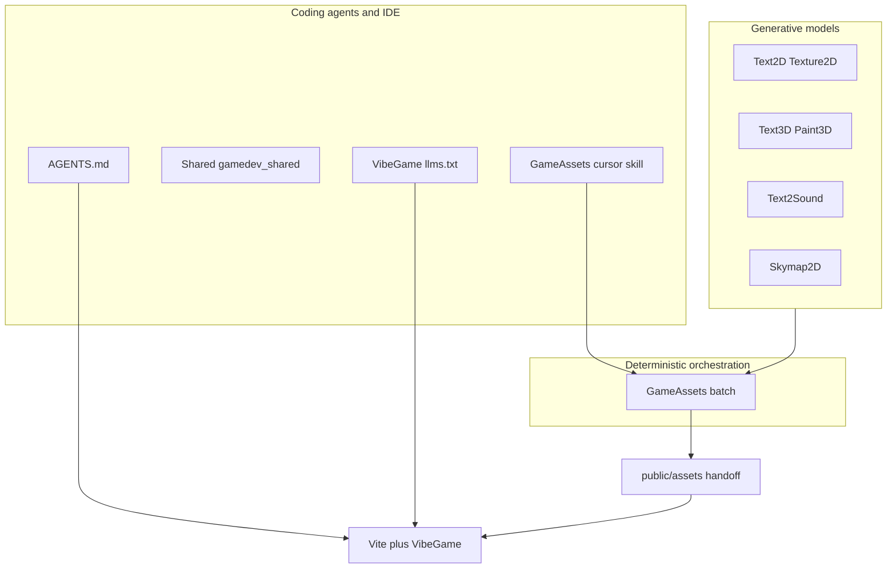

# Zero to game with AI — research and playbook

This document extends [MONOREPO_GAME_PIPELINE.md](MONOREPO_GAME_PIPELINE.md) with an **AI-centric** view: how generative tools, batch orchestration, and coding agents fit together. [Portuguese summary](ZERO_TO_GAME_AI_PT.md).

## 1. Three layers of “AI” in this monorepo

| Layer | Role | Typical inputs |
|-------|------|----------------|
| **Generative** | Images, meshes, audio, skies from prompts | Natural-language prompts, seeds, HF tokens |
| **Orchestration** | Repeatable pipelines, CSV manifests, logs | `game.yaml`, `manifest.csv`, `*_BIN` env vars |
| **Agentic** | Code, scene XML, iteration in the repo | Cursor rules, `llms.txt`, skills under `GameAssets/src/gameassets/cursor_skill/` |

None of these replaces the others: **prompts become files**, **files become URLs**, **agents edit code** that loads those URLs (e.g. `loadGltfToScene` in [VibeGame/src/extras/gltf-bridge.ts](../VibeGame/src/extras/gltf-bridge.ts)).

## 2. Recommended workflow (zero to playable loop)

1. **Install** the CLIs you need from the repo root ([INSTALLING.md](INSTALLING.md)): at minimum `gameassets`, tools referenced by your profile, and optionally `./install.sh vibegame` for the scaffold CLI.
2. **Author style and scope** in `game.yaml` + `manifest.csv` + presets; use `gameassets prompts` to review prompts before spending GPU/API quota.
3. **Run batch**: `gameassets batch --profile … --manifest …` with `--with-3d`, and optionally `--with-rig`, `--with-parts`, audio columns as needed ([GameAssets README](../GameAssets/README.md)).
4. **Validate assets**: optional `gamedev-lab debug …` on critical GLBs ([GameDevLab](../GameDevLab/)).
5. **Hand off to the web**: copy GLBs/audio into `public/assets/…` per [MONOREPO_GAME_PIPELINE.md](MONOREPO_GAME_PIPELINE.md); use [VibeGame/examples/monorepo-game](../VibeGame/examples/monorepo-game/) as a template.
6. **Iterate with an agent**: keep [AGENTS.md](../AGENTS.md) in context for monorepo conventions; for VibeGame-specific XML/API, attach or resolve [VibeGame/llms.txt](../VibeGame/llms.txt) (built for LLM system prompts). For GameAssets-only tasks, the [GameAssets skill](../GameAssets/src/gameassets/cursor_skill/SKILL.md) describes when to use which flags and env vars.

## 3. Context bundle for coding agents

| Goal | Primary context |
|------|------------------|
| Monorepo conventions, make targets, Python style | [AGENTS.md](../AGENTS.md) |
| VibeGame ECS, XML, plugins | [VibeGame/llms.txt](../VibeGame/llms.txt) (or Context7 “vibegame” if configured) |
| `gameassets` batch, CSV columns, `TEXT*_BIN` | [GameAssets README](../GameAssets/README.md), skill above |
| Asset folder layout and GLB loading | [MONOREPO_GAME_PIPELINE.md](MONOREPO_GAME_PIPELINE.md), `loadGltfToScene` |

Avoid pasting large generated assets into the chat; **link paths** under `public/` or attach **small** manifests instead.

## 4. Implemented follow-ups (recent)

| Item | Where |
|------|--------|
| Animator3D after rig (doc + commands) | [ANIMATOR3D_AFTER_RIG.md](ANIMATOR3D_AFTER_RIG.md) |
| Sky / env (equirect → PMREM) | `applyEquirectSkyEnvironment` in VibeGame (`vibegame`, export `vibegame/extras/sky`) |
| Export pack | `gameassets handoff --public-dir …` → `public/assets/…` + `gameassets_handoff.json` |
| Batch plan JSON for agents | `gameassets batch --dry-run --dry-run-json plan.json` |
| Declarative GLB | `<gltf-load url="/assets/models/foo.glb"></gltf-load>` in world XML |

## 5. Further R&D (optional)

| Priority | Idea |
|----------|------|
| Medium | Zip/tar of `public/assets` for CI artefacts |
| Low | `gameassets resume --dry-run-json` parity with `batch` |

## 6. References

- [MONOREPO_GAME_PIPELINE.md](MONOREPO_GAME_PIPELINE.md) — folder layout and web contract  
- [VibeGame README — GLB handoff](../VibeGame/README.md)  
- [Shared](../Shared/) — `gamedev_shared`, unified installer including `vibegame`  
- Upstream VibeGame AI workflow (Context7, Shallot): see [VibeGame README](../VibeGame/README.md) “AI Context Management”
