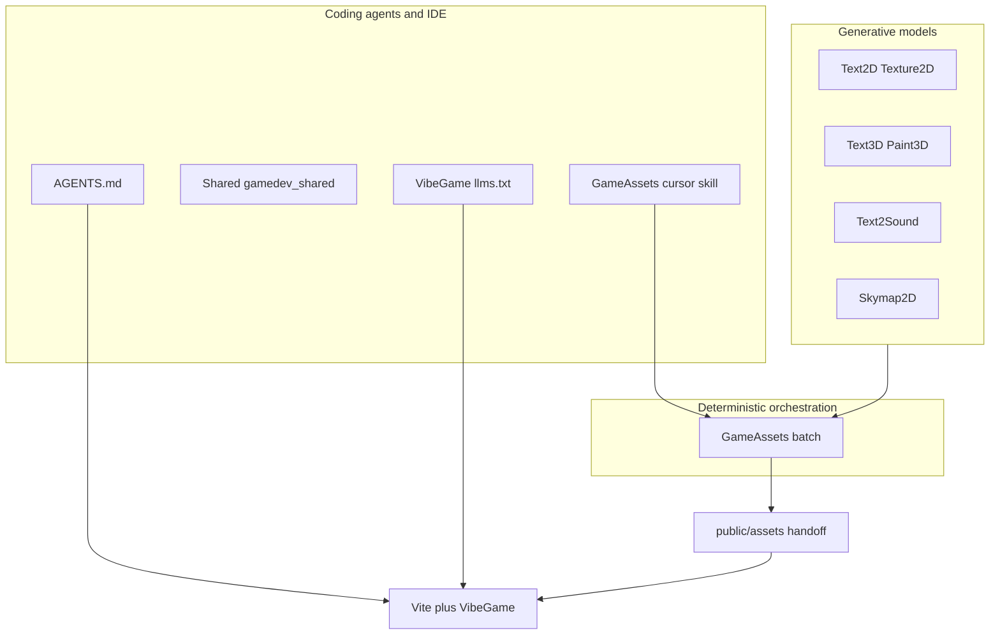

# Zero to game with AI — research and playbook

This document extends [MONOREPO_GAME_PIPELINE.md](MONOREPO_GAME_PIPELINE.md) with an **AI-centric** view: how generative tools, batch orchestration, and coding agents fit together. [Portuguese summary](ZERO_TO_GAME_AI_PT.md).

## 1. Three layers of “AI” in this monorepo



| Layer | Role | Typical inputs |
|-------|------|----------------|
| **Generative** | Images, meshes, audio, skies from prompts | Natural-language prompts, seeds, HF tokens |
| **Orchestration** | Repeatable pipelines, CSV manifests, logs | `game.yaml`, `manifest.csv`, `*_BIN` env vars |
| **Agentic** | Code, scene XML, iteration in the repo | Cursor rules, `llms.txt`, skills under `GameAssets/src/gameassets/cursor_skill/` |

None of these replaces the others: **prompts become files**, **files become URLs**, **agents edit code** that loads those URLs (e.g. `loadGltfToScene` in [VibeGame/src/extras/gltf-bridge.ts](../VibeGame/src/extras/gltf-bridge.ts)).

## 2. Recommended workflow (zero to playable loop)

1. **Install** the CLIs you need from the repo root ([INSTALLING.md](INSTALLING.md)): at minimum `gameassets`, tools referenced by your profile, and optionally `./install.sh vibegame` for the scaffold CLI.
2. **Author style and scope** in `game.yaml` + `manifest.csv` + presets; use `gameassets prompts` to review prompts before spending GPU/API quota.
3. **Run batch**: `gameassets batch --profile … --manifest …` with `--with-3d`, and optionally `--with-rig`, **`--with-animate`** (full character pipeline: rig + Animator3D game-pack), `--with-parts`, audio columns as needed ([GameAssets README](../GameAssets/README.md)).
4. **Validate assets**: optional `gamedev-lab debug …` on critical GLBs ([GameDevLab](../GameDevLab/)).
5. **Hand off to the web**: copy GLBs/audio into `public/assets/…` per [MONOREPO_GAME_PIPELINE.md](MONOREPO_GAME_PIPELINE.md); use [VibeGame/examples/monorepo-game](../VibeGame/examples/monorepo-game/) as a template.
6. **Iterate with an agent**: keep [AGENTS.md](../AGENTS.md) in context for monorepo conventions; for VibeGame-specific XML/API, attach or resolve [VibeGame/llms.txt](../VibeGame/llms.txt) (built for LLM system prompts). For GameAssets-only tasks, the [GameAssets skill](../GameAssets/src/gameassets/cursor_skill/SKILL.md) describes when to use which flags and env vars.

## 3. Complete animation pipeline

End-to-end flow for a textured, rigged, animated character in the browser:

**Text → Image → 3D Model → Texture → Rig → Animate → Handoff → VibeGame**

### Animator3D after rig

After **Rigging3D** produces a rigged GLB, **Animator3D** bakes procedural game animations into the asset with `game-pack`:

```bash
animator3d game-pack rigged.glb animated.glb --preset humanoid
```

The `humanoid` preset creates five clips: **BreatheIdle**, **Walk**, **Run**, **Jump**, and **Fall** (stored in the GLB with the `Animator3D_` prefix; see below). Other presets (`creature`, `flying`, …) produce different clip sets; see [ANIMATOR3D_AFTER_RIG.md](ANIMATOR3D_AFTER_RIG.md).

### GameAssets integration

- **`gameassets batch --with-3d --with-rig --with-animate`** runs the full pipeline, including **Animator3D** game-pack when the manifest marks rows for animation (after rig).
- **`gameassets dream`** auto-animates characters: the emitted batch step includes **`--with-animate`** alongside `--with-3d` and `--with-rig`.

### VibeGame: declarative animated player

Instead of custom glue code for every project, use the **`player-gltf`** element in world XML. It loads the GLB, plays **idle / walk / run** (and related states when clips exist), and replaces the default box character:

```html
<player-gltf pos="0 0 0" model-url="/assets/models/hero.glb"></player-gltf>
```

### Origin convention (feet on the floor)

- **Text3D** uses **`origin=feet`** by default: base at **Y = 0**, **XZ** centered on the mesh.
- **Paint3D** preserves that with **`--preserve-origin`** when texturing so the painted mesh stays aligned.
- **Rigging3D** validates the origin after merge so rigs and animations stay grounded.

### Animation clip naming (`humanoid` game-pack)

Clips in the exported GLB use this naming:

- `Animator3D_BreatheIdle`
- `Animator3D_Walk`
- `Animator3D_Run`
- `Animator3D_Jump`
- `Animator3D_Fall`

Runtime (`player-gltf` and related systems) maps movement to these names (or compatible aliases).

## 4. Context bundle for coding agents

| Goal | Primary context |
|------|------------------|
| Monorepo conventions, make targets, Python style | [AGENTS.md](../AGENTS.md) |
| VibeGame ECS, XML, plugins | [VibeGame/llms.txt](../VibeGame/llms.txt) (or Context7 “vibegame” if configured) |
| `gameassets` batch, CSV columns, `TEXT*_BIN` | [GameAssets README](../GameAssets/README.md), skill above |
| Asset folder layout and GLB loading | [MONOREPO_GAME_PIPELINE.md](MONOREPO_GAME_PIPELINE.md), `loadGltfToScene` |

Avoid pasting large generated assets into the chat; **link paths** under `public/` or attach **small** manifests instead.

## 5. Implemented follow-ups (recent)

| Item | Where |
|------|--------|
| Animator3D after rig (doc + commands) | [ANIMATOR3D_AFTER_RIG.md](ANIMATOR3D_AFTER_RIG.md) |
| Sky / env (equirect → PMREM) | `applyEquirectSkyEnvironment` in VibeGame (`vibegame`, export `vibegame/extras/sky`) |
| Export pack | `gameassets handoff --public-dir …` → `public/assets/…` + `gameassets_handoff.json` |
| Batch plan JSON for agents | `gameassets batch --dry-run --dry-run-json plan.json` |
| Declarative GLB | `<gltf-load url="/assets/models/foo.glb"></gltf-load>` in world XML |
| Animated player (XML) | `<player-gltf model-url="…">` — idle/walk/run from input; see [§3 Complete animation pipeline](#3-complete-animation-pipeline) |

## 6. `gameassets dream` — idea-to-game in one command

The `dream` command closes the last manual gap: it takes a **natural-language description** of a game, calls an **LLM** to plan assets and scene layout, then runs **batch + skymap + handoff** and scaffolds a **playable Vite project** with VibeGame.

```bash
gameassets dream "platformer 3D com cristais num mundo de nuvens, estilo lowpoly" --dry-run
```

| Phase | What happens |
|-------|--------------|
| 1. Plan | LLM generates `dream_plan.json` (title, genre, assets, scene placements, sky prompt) |
| 2. Emit | Converts plan into `game.yaml`, `manifest.csv`, `world.xml`, `main.ts`, `index.html` |
| 3. Batch | `gameassets batch --with-3d --with-rig --with-animate` on the emitted profile/manifest |
| 4. Sky | `skymap2d generate` from the sky prompt (equirect PNG) |
| 5. Handoff | `gameassets handoff --public-dir <project>/public` |
| 6. Scaffold | Creates `package.json`, `vite.config.ts`, copies emitted `main.ts` + `index.html` |

`--dry-run` stops after phase 2 (no GPU), so you can review/edit files before running batch.

Providers: `--llm-provider openai` (default), `huggingface`, or `stdin`. Falls back to a minimal plan if no LLM is available.

Source: `GameAssets/src/gameassets/dream/` (planner, emitter, runner, llm_context).

## 7. Further R&D (optional)

| Priority | Idea |
|----------|------|
| Medium | Zip/tar of `public/assets` for CI artefacts |
| Low | `gameassets resume --dry-run-json` parity with `batch` |
| Low | Multi-turn LLM refinement in `dream` (iterate on plan before generating) |

## 8. References

- [MONOREPO_GAME_PIPELINE.md](MONOREPO_GAME_PIPELINE.md) — folder layout and web contract  
- [VibeGame README — GLB handoff](../VibeGame/README.md)  
- [Shared](../Shared/) — `gamedev_shared`, unified installer including `vibegame`  
- Upstream VibeGame AI workflow (Context7, Shallot): see [VibeGame README](../VibeGame/README.md) “AI Context Management”
