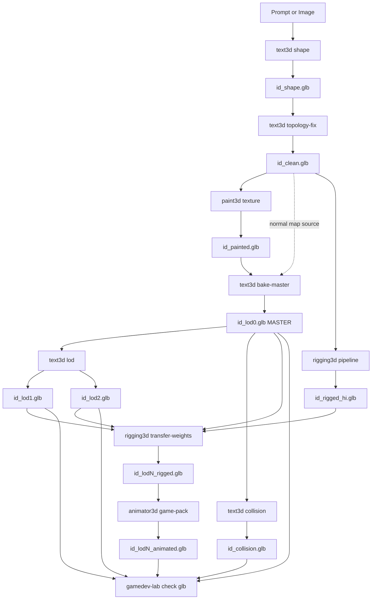

# Game Asset Pipeline Redesign

**Status:** Draft → Implementation
**Date:** 2026-05-02
**Owners:** GameAssets, Text3D, Paint3D, Rigging3D, Animator3D, GameDevLab

## Contexto

A pipeline atual produz GLBs incoerentes entre estágios. Análise empírica dos
assets em `VibeGame/examples/simple-rpg/public/assets/meshes/`:

| Asset | Estágio | Tamanho | Verts | Tris | V/Tri |
|---|---|---:|---:|---:|---:|
| goblin | shape | 31.8 MB | 1.192.135 | 397.795 | **3.00** |
| goblin | painted | 1.9 MB | 41.593 | 24.000 | 1.73 |
| goblin | rigged | **64.1 MB** | 1.191.813 | 397.795 | **3.00** |
| goblin | rigged_animated | 64.5 MB | 1.192.116 | 397.795 | 3.00 |
| goblin | lod0 | 1.9 MB | 41.593 | 24.000 | 1.73 |
| hero | shape | 5.2 MB | 112.555 | 225.087 | 0.50 |
| hero | rigged | 9.0 MB | 123.710 | 224.656 | 0.55 |

**Problemas identificados:**

1. `goblin_shape.glb` saiu com V/Tri=3.00 (cada triângulo com 3 vértices únicos)
   por causa de `mesh.normals_split_custom_set(loop_normals)` em
   [`Text3D/src/text3d/utils/mesh_lod.py`](../../Text3D/src/text3d/utils/mesh_lod.py)
   `_restore_smooth_normals`, que força o exporter GLTF do Blender a duplicar
   verts por canto de face. Hero/mushroom escapam por terem caminho diferente.
2. `goblin_rigged.glb` = 64 MB porque rigging corre sobre `_shape` (cru,
   1.19M verts), não sobre o painted/lod0.
3. `goblin_lod0` é byte-equivalente a `goblin_painted` (ficheiro duplicado).
4. Decimação inconsistente entre assets (goblin 16×, hero 7×, mushroom 34×).
5. Sem TANGENT em nenhum GLB (PBR pede MikkTSpace).
6. Sem KTX2/Basis nas texturas, sem `EXT_meshopt_compression` na geometria.
7. Origin é tocado em 3 sítios independentes (text3d export, paint3d, rigging3d).
8. `prepare_mesh_topology` corre antes do paint, mas o paint depois decima e
   re-cria a topologia, descartando parte do trabalho.

## Princípios da nova pipeline

1. **LOD0 é o master.** Tudo que vai para o jogo (rigged, animated, lod1, lod2,
   collision) deriva do LOD0 ou do `_clean` (high-poly limpo). Shape e Painted
   são intermediários descartáveis em `_intermediate/`.
2. **Cada estágio tem responsabilidade única e contrato explícito.** Quem faz
   weld só faz weld; quem faz origin só faz origin; ninguém repete o trabalho
   do outro.
3. **Topologia é congelada UMA vez** (no `bake-master`). A jusante só decimação
   determinística e baking.
4. **Validação por categoria é gate.** Asset que não passar `check glb` aborta
   com erro, não silencia.
5. **Rigging high-fidelity:** UniRig corre sobre `_clean.glb` (high-poly), e os
   pesos são transferidos para LOD0/1/2 via `data_transfer` do bpy.

## DAG



## Layout de ficheiros

`assets/meshes/` (final, vai para o jogo):
- `id_lod0.glb`, `id_lod1.glb`, `id_lod2.glb`
- `id_lod0_rigged.glb`, `id_lod0_animated.glb` e variantes lod1/lod2
- `id_collision.glb`

`assets/_intermediate/` (debug, NÃO carregado pelo jogo):
- `id_shape.glb`, `id_clean.glb`, `id_painted.glb`, `id_rigged_hi.glb`,
  `id_normal_map.png`

## Estágios — contratos

### Stage 1. `text3d shape`

Gera saída crua de marching cubes; SEM weld, SEM smooth, SEM rotação, SEM origin.
Output indexed (V/Tri ≤ 1.0). Deixa de chamar `prepare_mesh_topology` e
deixa de aplicar `save_mesh(rotate=True, origin_mode=...)`.

### Stage 2. `text3d topology-fix` (NOVO)

Corre `prepare_mesh_topology` num comando explícito:

1. `merge_by_distance` exato (1e-5).
2. Weld adaptativo (`_dynamic_weld_distance`).
3. `make_normals_consistent`.
4. `fill_holes(sides=12)` (reduzido de 30).
5. `shade_smooth` por auto-smooth angle. **NÃO** chama
   `normals_split_custom_set` — esta é a raiz do bug do goblin.
6. Rotação Y-up + origin (`feet`/`center`/`none`) — único sítio que mexe.
7. Export GLB sem custom split normals.

Output: `_intermediate/id_clean.glb`. Target V/Tri ≤ 0.6.

### Stage 3. `paint3d texture`

- Recebe `_clean.glb`.
- `--preserve-origin` é o defeito mandatório.
- Decimação interna do Hunyuan-Paint desativada.
- Output: `_intermediate/id_painted.glb`.

### Stage 4. `text3d bake-master` (NOVO)

Estágio central — produz o LOD0 final.

Inputs: `--painted`, `--high-poly` (clean), `--target-faces N`, `--bake-normals`
(default true), `--ktx2` (default true), `--meshopt` (default true).

1. Decimação UV-aware via `pymeshlab` (já existe em `mesh_remesh_textured.py`).
2. Bake normal map (high → low) via bpy → `_intermediate/id_normal_map.png`,
   adicionado como `normalTexture`.
3. Recalcular tangents (MikkTSpace) e exportar com `export_tangents=True`.
4. Pós: `npx @gltf-transform/cli uastc` + `npx @gltf-transform/cli meshopt`.
5. Validação inline: `gamedev-lab check glb`. Falha aborta o asset.

Output: `assets/meshes/id_lod0.glb`.

### Stage 5. `text3d lod`

- Input: `id_lod0.glb`.
- LOD1: 50% faces e textura a ½. LOD2: 25% e textura a ¼.
- Aplica meshopt + KTX2.

### Stage 6. `text3d collision`

- Input: `id_lod0.glb`.
- Convex hull ou simplificação extrema (≤ 256 faces).

### Stage 7. `rigging3d pipeline`

- Input: `_intermediate/id_clean.glb`.
- Output: `_intermediate/id_rigged_hi.glb`.

### Stage 8. `rigging3d transfer-weights` (NOVO)

`bpy.ops.object.data_transfer` com `data_type='VGROUP_WEIGHTS'` e
`vert_mapping='POLYINTERP_NEAREST'`. Copia armature do source para cada target.

Output: `assets/meshes/id_lod{0,1,2}_rigged.glb`.

### Stage 9. `animator3d game-pack`

Aplicado a cada `id_lod{0,1,2}_rigged.glb` → `id_lod{0,1,2}_animated.glb`.

### Stage 10. Validação (`gamedev-lab check glb`)

Estende [GameDevLab/src/gamedev_lab/cli.py](../../GameDevLab/src/gamedev_lab/cli.py)
com regras novas:

```yaml
mesh_totals:
  v_per_tri: { max: 1.6 }
attributes_required: [POSITION, NORMAL, TEXCOORD_0, TANGENT]
texture_format: ktx2
compression: meshopt
origin:
  y_min: { near: 0.0, tol: 0.01 }
face_count:
  max_per_category:
    humanoid: 38400
    creature: 28800
    weapon: 7200
```

Regras por categoria/LOD em `GameAssets/src/gameassets/data/rules/`.

## Métricas alvo (após implementação)

| Ficheiro (goblin) | Atual | Alvo |
|---|---:|---:|
| shape | 31.8 MB | ~10 MB (V/Tri ≤ 0.6) |
| clean (NOVO) | — | ~6 MB |
| painted | 1.9 MB | ~5 MB (high-poly + UV) |
| lod0 | 1.9 MB | **~400 KB** (KTX2 + meshopt + tangent) |
| lod1 | 0.9 MB | ~200 KB |
| lod2 | 0.5 MB | ~80 KB |
| rigged | **64 MB** | **~600 KB** |
| rigged_animated | 65 MB | ~700 KB |
| **TOTAL** | ~99 MB | **~2 MB** |

## Decisões resolvidas

1. **KTX2 + meshopt:** sim, no `bake-master`.
2. **Rigging:** sobre `_clean` com transfer para LOD0/1/2.
3. **Intermediários:** em `_intermediate/`.
4. **Bake de normal map:** sim, no `bake-master`.
5. **Validação:** strict (gate), aborta o asset.

## Dependências externas

- `npx @gltf-transform/cli` (KTX2, meshopt). Verificado em `text3d doctor`.
- `bpy 5.1` em Text3D, Rigging3D, Animator3D.
- `pymeshlab` em Text3D.
